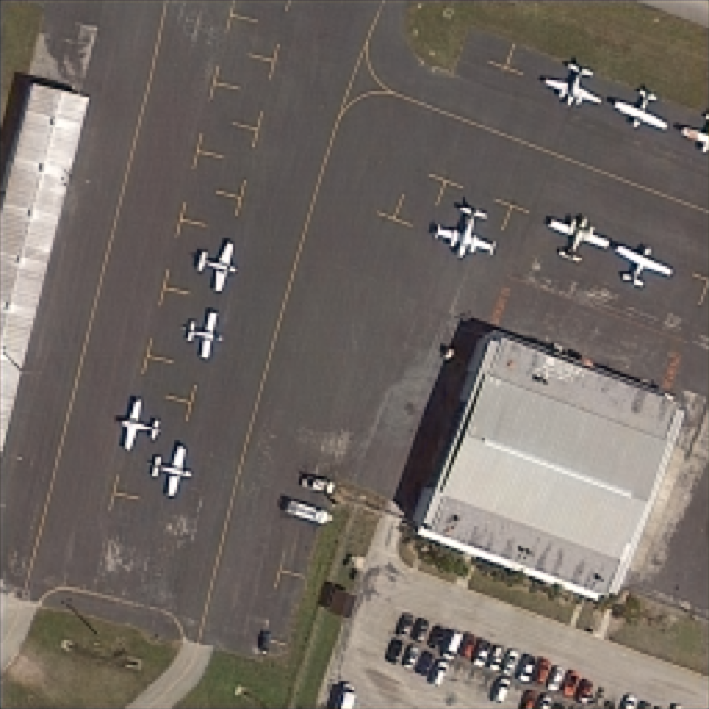
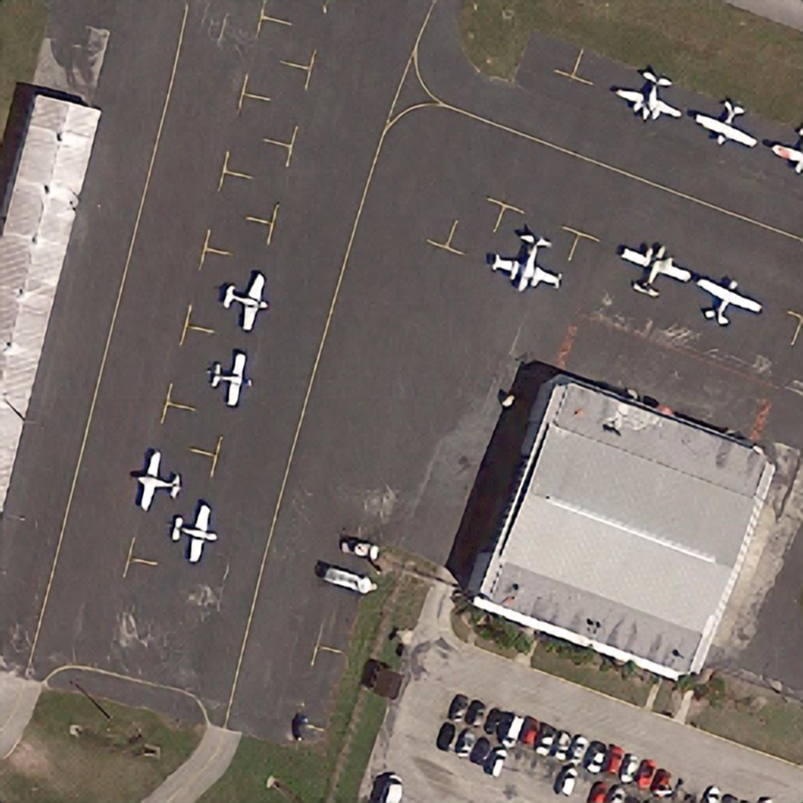
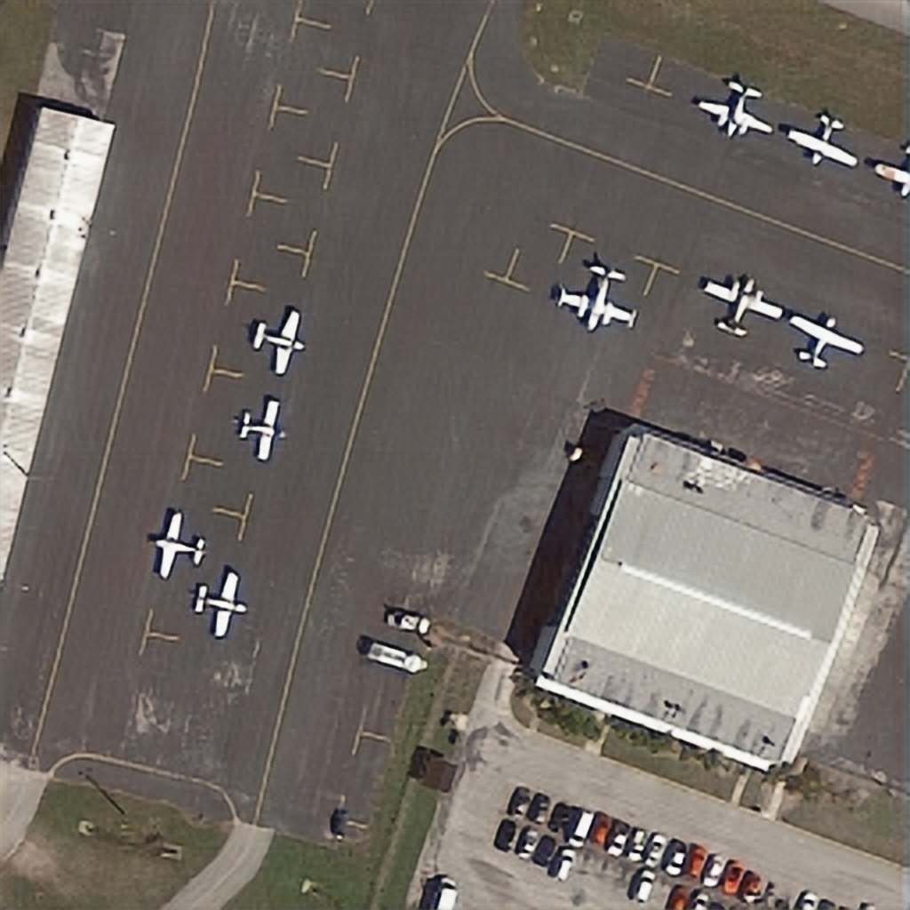

# Super-Resolution of Satellite Images using Deep Learning

## Overview

This project aimed to perform super resolution of satellite image using deep learning.

## Data Set

DOTA dataset is collection of satallite images with label showing its GSD (Ground Sampling Distance) and coordinate of objects.
Instead of using dataset for object detection or object classification problem, we uses for image super resolution.

- [A Large-Scale Benchmark and Challenges for Object Detection in Aerial Images](https://captain-whu.github.io/DOTA/index.html)

## Pre-Processing

Since dataset is not designed for image super resolution, we need to perform preprocessing of data to be able to perform the tasks.

1. Limit range of GSD to only keep high resolution image above our threashold
2. Crop images into multiple of 1024x1024 images
3. Some images of dataset contain black area, remove these samples
4. Images after this step is considered high resolution image (gold reference)
5. Downsample to create low resolution image. We do by reducing image to 216x216
6. Images after step 5 is considered low resolution image which is input to the model

This step is performed using following Jupyter notebooks.

 - [Dataset_Preprocessing.ipynb](Dataset_Preprocessing.ipynb)
 - [prepare_test_set.ipynb](prepare_test_set.ipynb)

## Deep Learning Models

Based on survey paper and review articles, following four arhcitectures are selected.

- [**SRCNN**](SRCNN.ipynb) : Pre-Upsampling Super Resolution

    - [Image Super-Resolution Using Deep Convolutional Networks](https://arxiv.org/abs/1501.00092)
    - [Implementation reference](https://github.com/yjn870/SRCNN-pytorch) 

- [**LAPSRN**](LAPSRN.ipynb) : Progressive Reconstruction Networks

    - [Fast and Accurate Image Super-Resolution with Deep Laplacian Pyramid Networks](http://vllab.ucmerced.edu/wlai24/LapSRN/)
    - [Implementation reference](https://github.com/twtygqyy/pytorch-LapSRN)

- [**RCAN**](RCAN.ipynb) : Attention-Based Network

    - [Image Super-Resolution Using Very Deep Residual Channel Attention Networks](https://arxiv.org/abs/1807.02758)
    - [Implementation reference](https://github.com/yjn870/RCAN-pytorch)

- [**SRGAN**](SRGAN.ipynb) : Generative Models

    - [Photo-Realistic Single Image Super-Resolution Using a Generative Adversarial Network](https://arxiv.org/abs/1609.04802)
    - [Implementation reference](https://github.com/leftthomas/SRGAN)

## Sample Result

High Resolution Image

Low Resolution Image

Bicubic Upsampling Image

SRCNN Image

LAPSRN Image

RCAN Image

SRGAN Image

## Result

The following table shows the experimental result.

|     Model     |     PSNR       |     SSIM      |     MOS     |
|---------------|----------------|---------------|-------------|
|     SRCNN     |     24.0418    |     0.7012    |     0.4     |
|     LAPSRN    |     24.5261    |     0.6769    |     0.12    |
|     RCAN      |     28.3393    |     0.7596    |     0.73    |
|     SRGAN     |     26.8289    |     0.7196    |     0.65    |
